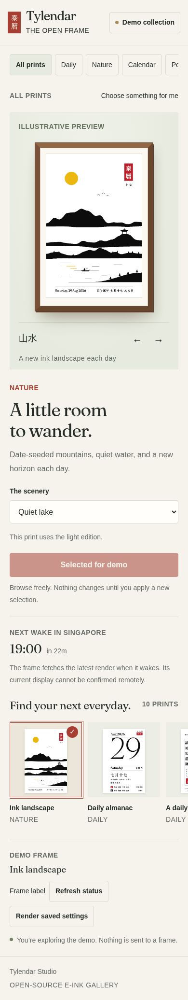

# Tylendar Studio

**The Open Frame**

An open-source e-ink gallery for a 10.2-inch display in a walnut brown IKEA RODALM frame. Browse ten prints, choose their settings, and send a selection to your frame from the web portal or Android app.

[Open the portal](https://chuatzeyee.github.io/tylendar-studio/) or [browse the source](https://github.com/chuatzeyee/tylendar-studio).

The portal opens in demo mode. You can explore the collection, try settings, read poems, and add demo photos without an account or a physical frame.

## Gallery

The interface uses an upright 泰曆 seal, readable labels, and a walnut frame preview. These screenshots show the local demo built from this repository.


| Web portal on a phone | Native Android app |
| --- | --- |
|  |  |

A [tablet screenshot](docs/screenshots/portal-tablet.png) is also available. The artwork in the gallery is a bundled design sample. Changing an option updates your draft; the renderer produces the final image after you apply it.

## Run the portal locally

The portal is plain HTML, CSS, and JavaScript. It has no package dependencies or build step. From the repository root:

```bash
python3 -m http.server 8765 --bind 127.0.0.1 --directory portal
```

Open <http://127.0.0.1:8765>. Use an HTTP server because the portal loads JavaScript modules and local poem data.

To host your own copy, enable GitHub Pages with **GitHub Actions** as the build source. The **Deploy portal** workflow tests and publishes `portal/` when that directory changes on `main`.

## Use the gallery

1. Choose a category or browse the print cards.
2. Select a print, adjust its options, and choose an edition where available.
3. Use **Try on the demo frame** to save a demo selection, or **Apply to frame** when connected. **Discard changes** restores the saved selection.
4. Use **Render saved settings** to request a fresh image. For an almanac, **Next render only** can force a light or dark edition for that single run.

**Latest render** opens the generated image from the connected repository. **Refresh status** checks repository settings and the rendering workflow. Neither action can confirm what is physically displayed on the frame, because the firmware does not report back.

**Frame label** changes the text beside the almanac's Wi-Fi symbol. It does not change the Wi-Fi network. Labels accept 1 to 24 ASCII letters, numbers, spaces, or punctuation.

### Connect your repository

Choose **Demo collection**, then enter the `owner/repository` that renders your frame and a fine-grained GitHub personal access token with **Contents** and **Actions** read/write access to that repository.

The repository must contain `generator/settings.json`, `.github/workflows/render.yml`, and the generated `output/` files on `main`. Connection validation only reads from GitHub. Applying settings writes the changed fields together in one commit, which starts a render.

The web token is kept in the browser tab's session and cleared on disconnect. The Android app encrypts its token with Android Keystore and excludes it from backups. A repository permission error leaves the draft available to retry.

### Photographs and poems

The photo manager accepts JPG and PNG files up to 20 MB each, resizes them before upload, and saves them to `generator/photos/`. Connected uploads and removals take effect immediately. Demo photos remain in memory for the current tab. Photographs in a public repository are public.

The Android app opens the connected repository's web portal for photo management. Both clients can show an English reading of the day's poem from the bundled collection of 135 Tang poems.

## Prints and settings

Settings are stored in [generator/settings.json](generator/settings.json). The portal and Android app expose the options below. They can also be edited directly on GitHub; committing a change under `generator/` starts the rendering workflow.

| Print | Page key | Options |
| --- | --- | --- |
| Daily almanac | `almanac` | Gregorian and lunar dates, solar terms, festivals, and daily yi/ji. `mode`: `auto`, `light`, or `dark`. |
| A daily poem | `poem` | A Tang poem each day. `poem_lang`: `cn` or `en`. |
| One character | `character` | A Chinese character with pinyin, meaning, compounds, radical, and stroke count. |
| Ink landscape | `landscape` | A landscape generated from the date. `landscape_scenery`: `lake`, `gorge`, `islands`, or `night`. |
| Seasonal flora | `flora` | The Four Gentlemen of ink painting. `flora_plant`: `season`, `plum`, `orchid`, `bamboo`, or `chrysanthemum`. |
| Island weather | `weather` | Singapore forecast, temperatures, UV, air quality, and rain probability from NEA and Open-Meteo at render time. |
| The month | `month` | Lunar dates, Singapore holidays, and calendar event markers. `month_week_start`: `monday` or `sunday`. |
| Year in progress | `year` | A square for each day. `year_lang`: `bilingual`, `en`, or `cn`. `year_footer`: `holidays`, `event`, or `weather`. |
| Your photographs | `photo` | Daily rotation through `generator/photos/`, reduced to the panel's four colors. |
| Local vocabulary | `joke` | Singlish profanity with definitions and examples. `joke_word`: `daily`, `jibai`, `kanina`, `lanjiao`, `nabei`, `jiaksai`, `sibei`, `walao`, or `siao`. |

Only the almanac supports a dark edition. With `mode: auto`, it changes to white text on black on weekday evenings and white text on red on weekend evenings. Other prints always use a light edition. Year footers fall back to the holiday countdown when event or weather data is unavailable.

See [docs/previews](docs/previews) for the bundled print samples, including both dark almanac editions. These are illustrative artwork assets, separate from the interface screenshots above.

## How the frame updates

Python and Pillow render a 640 × 960 portrait image, reduce it to black, white, yellow, and red, and pack it into the panel's native 960 × 640 orientation. Each render produces:

| File | Purpose |
| --- | --- |
| `output/preview.png` | The latest generated image for inspection. |
| `output/tylendar.bin` | 153,600 bytes of panel data, with four pixels per byte. |

GitHub Actions renders four times daily. The ESP32 wakes shortly afterward, downloads the binary, refreshes the panel, and returns to deep sleep.

| Render schedule | Frame wake |
| --- | --- |
| 00:05 | 00:20 |
| 07:05 | 07:30 |
| 12:35 | 13:00 |
| 18:35 | 19:00 |

All times are in Singapore time, UTC+08. The evening render prepares the dark almanac edition when automatic mode is selected. The midnight render prepares the next day's light edition. GitHub Actions schedules can be delayed, so these are scheduled times rather than delivery guarantees.

The panel refresh takes about 20 seconds. A failed or incomplete download leaves the existing image intact; the firmware retries in an hour. Pressing the board's EN button restarts it and fetches the latest available render.

## Build a physical frame

| Part | Specification |
| --- | --- |
| Display | Good Display GDEM102F91, 10.2 inch, 960 × 640, four colors, SSD2677 controller. |
| Controller | Good Display ESP32-L kit with an ESP32-WROOM-32D and DESPI-C02 adapter. |
| Frame | IKEA RODALM 21 × 30 cm in walnut brown, with the mat trimmed to fit the screen. |
| Power | USB-C. The ESP32-L has no battery circuit. |

1. Fork this repository and enable GitHub Actions. Run **Render daily calendar** once to create the output files.
2. Copy `firmware/Tylendar/config.example.h` to `firmware/Tylendar/config.h`. Add your Wi-Fi networks and set `IMAGE_URL` to the raw `output/tylendar.bin` URL in your own repository. The example points to the original Tylendar repository, so this value must be changed for your fork. The current firmware needs a URL it can download without GitHub authentication.
3. Flash the ESP32 using the [macOS flashing guide](docs/FLASHING_MACOS.md).
4. Follow the [assembly guide](docs/ASSEMBLY.md) for wiring, the adapter's RESE switch, and mat measurements.

`config.h` is ignored by Git. Keep network passwords out of tracked files.

If the frame cannot join a configured network, it opens a `Tylendar` Wi-Fi access point with password `tylendar` for three minutes. Connect from a phone and open <http://192.168.4.1> if the setup page does not appear automatically. The new network is saved on the board and tried first at the next wake.

### Optional calendar events

Save your calendar's private iCal feed URL as the repository's GitHub Actions secret `ICS_URL`. For Google Calendar, this is **Settings > Integrate calendar > Secret address in iCal format**.

The almanac can replace its yi/ji rows with the day's first two events, including time, title, and venue. Month and year pages can also use the feed. The URL stays in Actions secrets, but event details become pixels in the generated output; consider the visibility of the repository before adding a private calendar.

## Run the renderer locally

Use Python 3.12 and install the renderer dependencies in a virtual environment:

```bash
python3 -m venv .build-support/venv
.build-support/venv/bin/pip install -r generator/requirements.txt
PAGE=landscape OUT_DIR=.build-support/preview \
  .build-support/venv/bin/python generator/generate.py 2026-09-06
```

`PAGE` chooses a print without changing saved settings. `OUT_DIR` redirects both generated files; without it, the renderer writes to `output/`. The date argument is optional and defaults to the current Singapore date. `DARK=1` or `DARK=0` overrides the almanac edition for a single render. `ICS_URL` supplies a calendar feed when needed.

Page modules live in `generator/pages/`, with datasets in `generator/data/`. If a page fails to render, the generator falls back to the almanac.

## Build the Android app

Open `android/` in Android Studio. The pinned build uses JDK 17 or newer, Gradle 9.7.1, and Android SDK 37. The app supports Android 10 and later.

```bash
cd android
./gradlew testDebugUnitTest assembleDebug lintDebug
```

The debug APK is written to `android/app/build/outputs/apk/debug/app-debug.apk`. Its application ID is `com.chuatzeyee.tylendar.studio`, so it can coexist with the original Tylendar app. See the [Android build guide](docs/ANDROID_MACOS.md) for SDK installation and sideloading.

Hardware keys browse prints without applying changes: `A` almanac, `P` poem, `C` character, `L` landscape, `W` weather, `M` month, `Y` year, `J` vocabulary, `O` photos, and `F` flora. `R` renders the saved settings. Apply a draft with the on-screen button.

## Project layout and checks

| Directory | Contents |
| --- | --- |
| `portal/` | Static web gallery, GitHub client, and Node tests. |
| `android/` | Native Jetpack Compose gallery and unit tests. |
| `generator/` | Renderer, print modules, fonts, datasets, and photographs. |
| `firmware/` | ESP32 sketch and the panel's streaming driver. |
| `output/` | Generated preview and packed panel image. |
| `docs/` | Hardware and build guides, print previews, and current UI screenshots. |
| `review/` | Browser and emulator checks, screenshot capture tools, and validation notes. |

Run the dependency-free web tests with `npm test --prefix portal`. With the portal served on port 8765 and Python Playwright installed, run:

```bash
python3 -B review/browser_review.py
python3 -B review/capture_screenshots.py
```

The browser checks intercept GitHub requests locally. The capture script refreshes the web screenshots from the local portal. `review/android_review.py` builds no APK itself; it installs the existing debug APK on its own disposable emulator and captures the Android screenshots. Its SDK path is configurable through `ANDROID_HOME`.

See [review/VALIDATION.md](review/VALIDATION.md) for the recorded checks and [STUDIO.md](STUDIO.md) for implementation notes.

## Fonts and credits

Lunar calendar calculations use [lunar-python](https://github.com/6tail/lunar-python). Weather data comes from NEA and Open-Meteo. The web interface uses [Fraunces](https://github.com/undercasetype/Fraunces).

The renderer prefers MTR Sung and Canela when the licensed font files in `generator/fonts/licensed/` are present. Those fonts require their own licenses; a fork does not grant font rights. Removing that directory makes the renderer use the bundled open fonts: [Chiron Sung HK](https://github.com/chiron-fonts/chiron-sung-hk), Fraunces, and Noto Sans SC, under the SIL Open Font License. The Android app also bundles Canela under `android/app/src/main/res/font/`; using it requires an appropriate license or replacement fonts.
