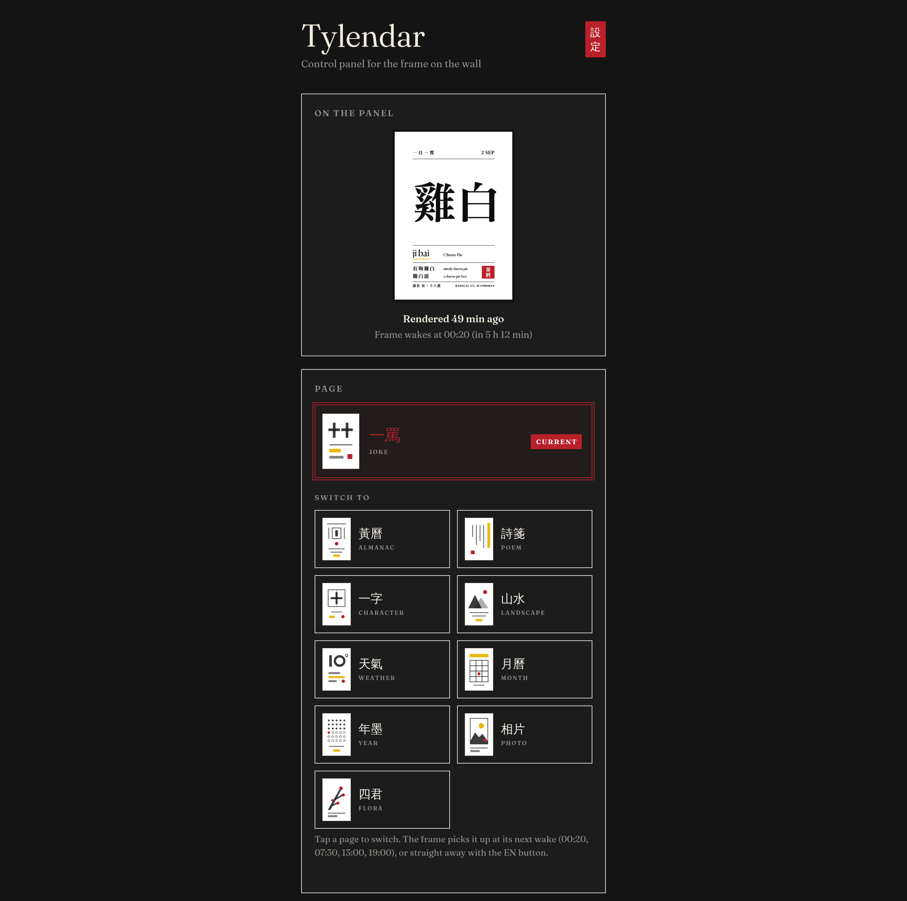
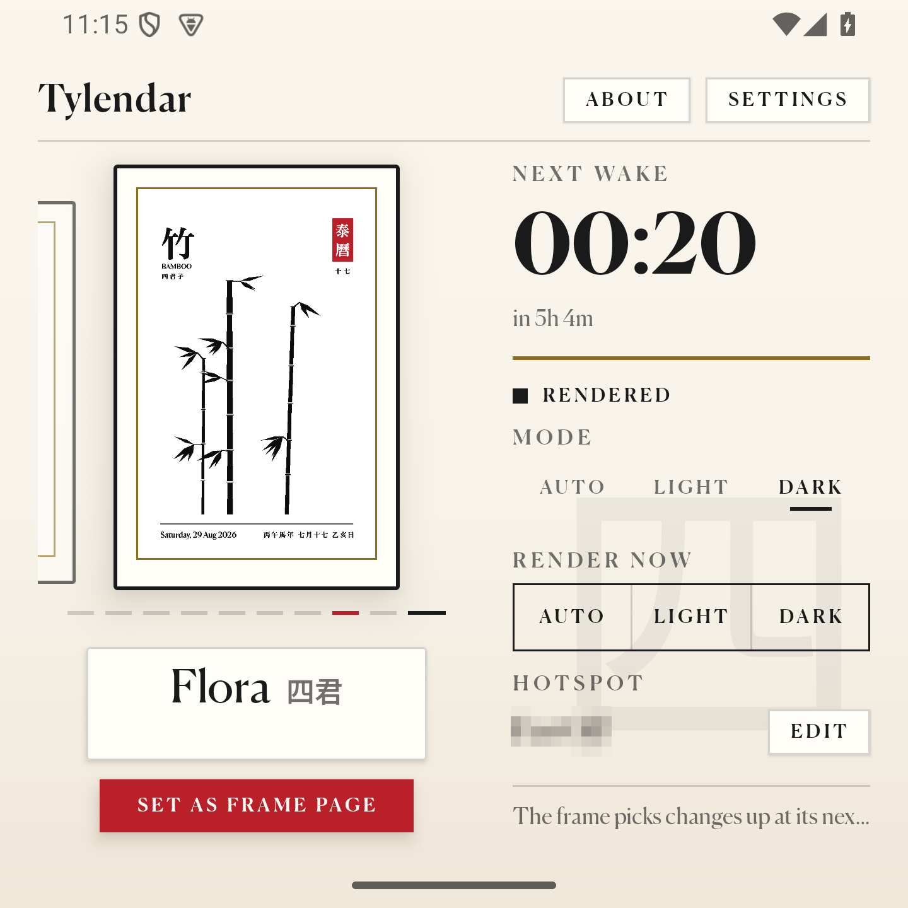
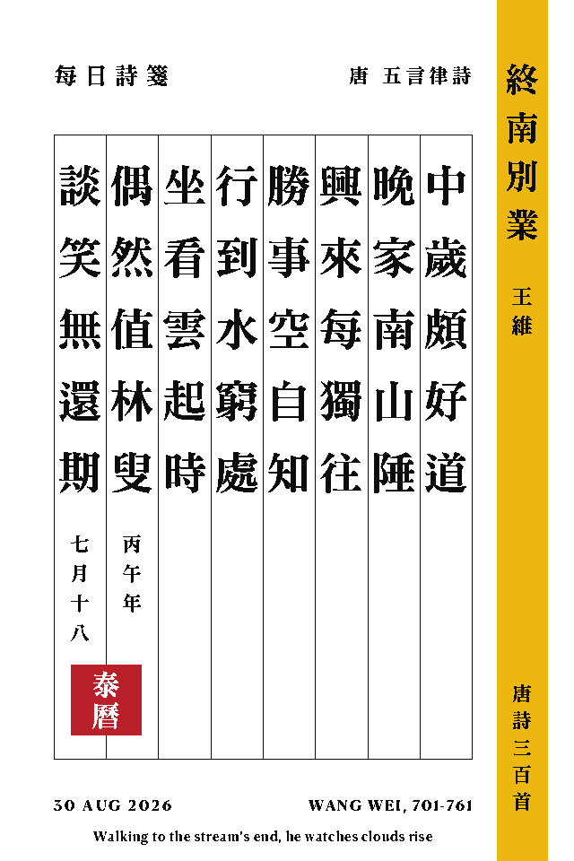
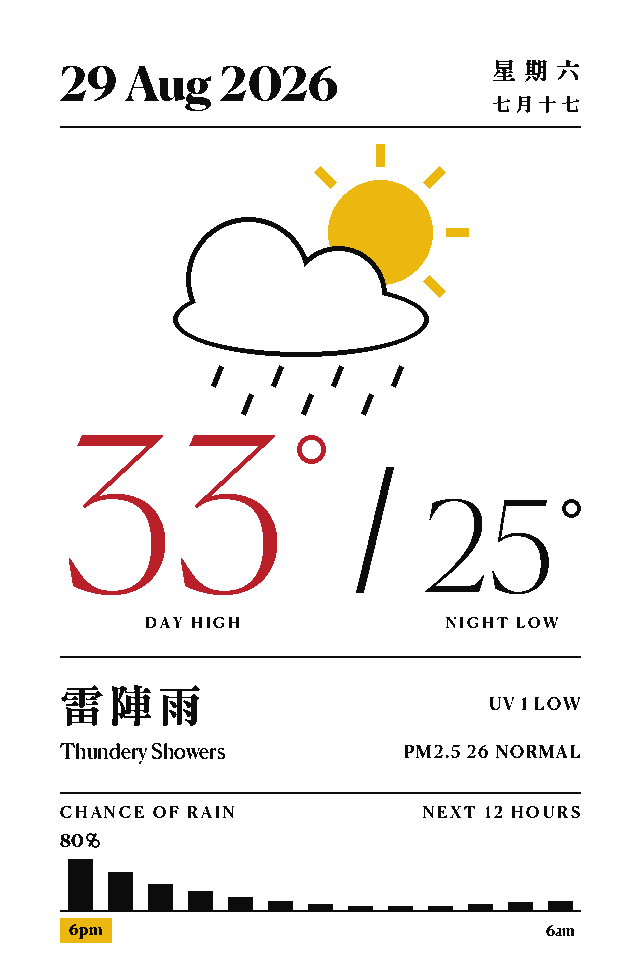
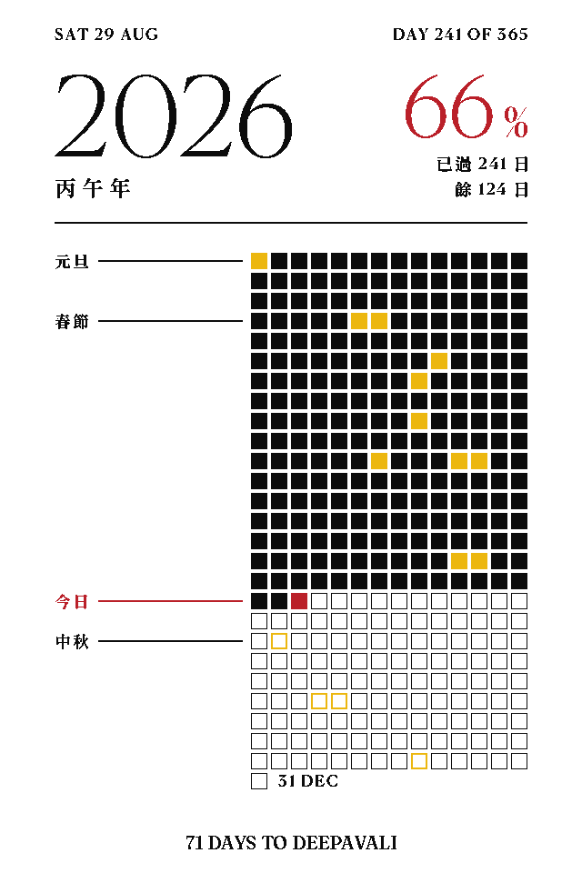

# Tylendar Studio

[**Open the live portal**](https://chuatzeyee.github.io/tylendar-studio/) —
explore all ten prints in demo mode without signing in.

This folder is the isolated Studio redesign. Start with [STUDIO.md](STUDIO.md)
for the revised web portal, Android app, local demo, build instructions,
and review results. The original project in `../Tylendar` is untouched.

The following material documents the inherited renderer and hardware;
the remote-control UI descriptions below describe the original edition.

---

# Tylendar

A wall mounted daily Chinese almanac (huangli) on a 10.2 inch four color
e-paper panel, framed in an IKEA RODALM. Every night at midnight it tears
off yesterday and shows the new day: Gregorian date, lunar date, ganzhi
pillars, zodiac year, solar terms, festivals, and the daily yi and ji.
It can also show other pages, picked from a phone: a Tang poem, a daily
character, an ink landscape, live Singapore weather, a month calendar,
or a year progress chart. See [Pages](#pages).

What the frame is showing right now (updates four times a day):


Previews of every page are in [Pages](#pages).

## How it works

1. A GitHub Action in this repo runs four times a day, at 00:05, 07:05,
   12:35, and 18:35 Singapore time. It renders the page with Python and
   Pillow, quantizes it to the four panel colors, and commits
   `output/tylendar.bin` (153600 bytes, 2 bits per pixel) plus a
   `preview.png`.
2. An ESP32 behind the frame wakes from deep sleep at 00:20, 07:30,
   13:00, and 19:00, joins WiFi, downloads the binary, and streams it
   straight to the panel. No frame buffer, no server, nothing to host.
3. The panel refreshes for about 20 seconds, then both the panel and the
   ESP32 go back to deep sleep until the next scheduled wake.

The 18:35 render is the dark one: from 19:00 the page shows white ink on
a black background on weekdays, and on a red background on weekends. The
midnight refresh returns to the light page for the new day.

## Hardware

| Part | Notes |
| --- | --- |
| Good Display GDEM102F91 | 10.2 inch, 960x640, black white yellow red, SSD2677 |
| Good Display ESP32-L kit | ESP32-WROOM-32D board with DESPI-C02 adapter |
| IKEA RODALM 21x30 frame | The included mat is trimmed to crop the screen |
| USB-C cable | The ESP32-L has no battery circuit, it is USB powered |

## Repo layout

```
generator/   Python renderer, page modules, page data, fonts
firmware/    Arduino sketch for the ESP32-L, panel driver included
output/      Rendered binary and preview, updated four times a day
portal/      Settings portal, served at chuatzeyee.github.io/Tylendar
android/     Android remote control app, sideloaded over adb
docs/        Flashing guide for macOS, hardware assembly guide
```

## Setup

1. Fork this repo (or use it as a template), then enable GitHub Actions
   on your fork. Run the "Render daily calendar" workflow once by hand so
   `output/tylendar.bin` exists.
2. Copy `firmware/Tylendar/config.example.h` to `config.h` (same folder,
   gitignored so your passwords never get committed), then edit it: the
   WiFi network list (every place the frame lives) and, if you forked,
   your own raw.githubusercontent.com URL.
3. Flash the firmware to the ESP32-L. Full walkthrough for macOS in
   [docs/FLASHING_MACOS.md](docs/FLASHING_MACOS.md).
4. Assemble the display, adapter, and frame. See
   [docs/ASSEMBLY.md](docs/ASSEMBLY.md), including the RESE switch
   position and mat cutting measurements.
5. Optional: show your Google Calendar on the page. In Google Calendar
   open Settings, pick your calendar, then "Integrate calendar" and copy
   the "Secret address in iCal format". Save it as a repo secret named
   `ICS_URL`:

   ```
   gh secret set ICS_URL
   ```

   Each render then replaces the yi ji almanac rows with the day's
   first two events, laid out as a table of time, title, and venue with
   a map pin. Days with no events keep the almanac rows. The secret
   address stays in GitHub Actions; nothing from your calendar is
   committed except the rendered pixels. Events added during the day
   appear at the next refresh, so by 07:30, 13:00, or 19:00 at the
   latest.

## Changing settings from a phone

The portal at https://chuatzeyee.github.io/Tylendar/ shows the current
page, the render status, and the next wake, and lets you pick which
page the frame shows (almanac, poem, character, landscape, weather,
month, year, joke, photo, or flora), change the page mode, the per page options, the
hotspot label, or force a
render. It is a static page
served by GitHub Pages (source in `portal/`), locked behind a fine
grained personal access token that you create once (Contents and
Actions, read and write, this repo only): the page stays blank until
GitHub confirms the token can write to this repo, and the token never
leaves your browser. The board picks up any change at its next wake,
or immediately if you press the EN button on the back of the frame.



There is also a native Android app in `android/`, a private gallery
version of the same remote: swipe between the ten pages, stamp one
onto the frame, read today's poem in English, switch modes, tune the
page options, or force a
render. Build and sideload instructions in
[docs/ANDROID_MACOS.md](docs/ANDROID_MACOS.md).



Everything the portal does can also be done on github.com directly,
with your GitHub login (and 2FA) as the front door:

- Edit settings: open
  [generator/settings.json](generator/settings.json) on github.com, tap
  the pencil, change a value, commit. The commit triggers a re-render
  automatically, done in about two minutes.
  - `"hotspot"`: the label next to the WiFi icon at the top of the page.
    Keep it to plain ASCII, the bundled Latin font has no CJK glyphs.
  - `"mode"`: `"auto"` (light by day, dark from 19:00), or pin it with
    `"dark"` or `"light"` until you change it back.
  - `"page"`: which page the frame shows, see [Pages](#pages) below.
  - Per page options, all optional; leave a key out and the page
    renders exactly as before (the first value is the default):
    - `"year_lang"`: `"bilingual"`, `"en"`, or `"cn"`.
    - `"year_footer"`: `"holidays"`, `"event"` (counts down to the next
      event on the `ICS_URL` feed), or `"weather"` (today's outlook).
      Either falls back to the holiday countdown when it has nothing to
      show.
    - `"landscape_scenery"`: `"lake"`, `"gorge"`, `"islands"`, or
      `"night"`.
    - `"month_week_start"`: `"monday"` or `"sunday"`.
    - `"poem_lang"`: `"cn"` or `"en"`.
    - `"joke_word"`: `"daily"` rotates through the deck, or pin one of
      `"jibai"`, `"kanina"`, `"lanjiao"`, `"nabei"`, `"jiaksai"`,
      `"sibei"`, `"walao"`, `"siao"`.
    - `"flora_plant"`: `"season"` follows the Four Gentlemen through the
      year, or pin `"plum"`, `"orchid"`, `"bamboo"`, or
      `"chrysanthemum"`.
- Force a refresh now: repo Actions tab, "Render daily calendar", "Run
  workflow". The mode dropdown there forces light or dark for that one
  render only; scheduled renders go back to following settings.json.
- Change the calendar feed: repo Settings, "Secrets and variables",
  "Actions", update `ICS_URL`, then run the workflow once.

### Pages

The frame can show more than the almanac. Switch pages from the portal,
or set `"page"` in
[generator/settings.json](generator/settings.json). The next scheduled
render picks it up, or force one from the Actions tab.

- `almanac`: the daily huangli described above, the default, and the
  only page with a dark mode.
- `poem`: a Tang poem a day, set in ruled vertical columns read right
  to left, from a pool of 135 five character poems curated out of the
  Three Hundred Tang Poems.
- `character`: one large character a day, with pinyin and tone, the
  meaning, two compound words, the radical, and the stroke count.
- `landscape`: a shanshui ink landscape composed from the date, with
  the lunar day stamped under the seal, so no two days look the same.
- `weather`: live Singapore weather fetched at render time, from NEA
  (day high, night low, forecast, UV, PM2.5) and Open-Meteo (chance of
  rain, next 12 hours).
- `month`: a month calendar with lunar dates, gazetted Singapore public
  holidays, solar terms, festival chips, and calendar event dots when
  `ICS_URL` is set.
- `year`: how far into the year today is, a waffle chart of the year's
  days with today, the public holidays, and the major festivals marked,
  and a countdown to the next holiday.
- `joke`: the character page played straight, except the headword is a
  Singlish profanity a day, romanized where the pinyin would be, with a
  polite English pun for the meaning and two usage examples. The
  `joke_word` option pins a favourite.
- `photo`: a photo a day from `generator/photos/`, dithered down to the
  panel's four colors and matted like a small gallery print. Add and
  remove photos from the portal (they are shrunk in the browser before
  upload), or drop files straight into that folder. Mind that the repo
  is public, so any photo in the rotation is too.
- `flora`: the Four Gentlemen of ink painting, one plant a season (plum
  blossom in winter, orchid in spring, bamboo in summer, chrysanthemum
  in autumn), grown procedurally from the date so each day is a new
  plant. The `flora_plant` option pins one year round.

| almanac | poem | character |
| --- | --- | --- |
|  |  |  |
| **landscape** | **weather** | **month** |
|  |  |  |
| **year** | **joke** | **photo** |
|  |  |  |
| **flora** | **almanac, dark weekday** | **almanac, dark weekend** |
|  |  |  |

Previews rendered for 2026-08-29 (dark weekday for 2026-08-28) with the
`PAGE`, `DARK`, and `OUT_DIR` variables described in
[Renderer](#renderer) below.

Page modules live in `generator/pages/`, one file per page, with their
data files in `generator/data/`. A page that fails to render (say the
weather APIs are down) falls back to the almanac instead of leaving the
wall blank. Every page other than the almanac always renders light;
dark mode stays an almanac only feature.

## Renderer

`generator/generate.py` draws a 640x960 portrait page. All text is drawn
through thresholded masks so every pixel is exactly one of the four panel
colors; anti-aliased edges would otherwise quantize into speckle. Red is
reserved for Sundays, festivals, and the year seal. Yellow is used
sparingly, only for the solar term tag, since large yellow fields render
muddy on this film.

Render any date to check the layout. `PAGE` previews any page without
touching settings.json, and `OUT_DIR` writes the files somewhere other
than `output/`:

```
python3 generator/generate.py 2027-02-06
PAGE=poem OUT_DIR=/tmp/check python3 generator/generate.py 2027-02-06
```

The packed format matches the panel: rows of 960 pixels, 4 pixels per
byte, most significant bits first, 00 black, 01 white, 10 yellow, 11 red.

## Firmware

`firmware/Tylendar/epd_gdem102f91.cpp` is a small streaming driver whose
init sequence is transcribed from the official Good Display sample code
(AU-GDEM0102F91, 2024-02-01). It is not the generic SSD2677 sequence:
eight registers differ from the closest GxEPD2 driver, they are the
factory tuned booster and waveform values for this exact film.

The sketch never refreshes a partial download. If WiFi or the download
fails it leaves the previous image on screen and retries in an hour.

### Changing WiFi without reflashing

If the board cannot join any network from `config.h`, it opens its own
WiFi access point named `Tylendar` (password `tylendar`) for 3 minutes
before going back to sleep. Join it from a phone and a setup page pops
up (or browse to http://192.168.4.1) where you type the new network
name and password. They are saved to the board's flash, never to this
repo, and that network is tried first at every wake from then on.

So when your WiFi changes: power cycle the frame, wait a couple of
minutes while it fails through the old list, then look for the
`Tylendar` network on your phone.

## Credits

Lunar calendar math by [lunar-python](https://github.com/6tail/lunar-python)
(MIT), verified against the Hong Kong Observatory conversion tables.

The render prefers the licensed faces in `generator/fonts/licensed/`:
MTR Sung (`mtr-sung.ttf`) for Chinese, with per character fallback for
simplified forms it lacks, and Canela Web
(`canelaweb-{thin,regular,medium,bold,black}.ttf`) for Latin text and
the large date numeral. These are distributed here under the owner's
license; if you fork this repo, check that your own use is covered or
delete the directory.

If `fonts/licensed/` is emptied the render falls back to open fonts,
all under the SIL Open Font License, bundled in `generator/fonts/`:

- [Chiron Sung HK](https://github.com/chiron-fonts/chiron-sung-hk) for
  Chinese text, a Hong Kong Song style face in the spirit of the MTR
  signage typeface, subset to the characters the almanac can emit
  (see `generator/subset_fonts.py`)
- [Fraunces](https://github.com/undercasetype/Fraunces) for Latin text
  and the large date numeral
- Noto Sans SC for the small chip labels, same subset
